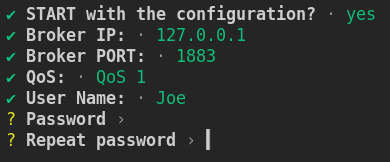

# rs_mqtt_client_pub
Simple MQTT publisher client (1Hz / local time) with CLI user input. 

CLI user input realized with "dialoguer"

## CLI Welcome view

## Broker IP; ip_v4 check and default as "localhost"

## Broker PORT; with "Selection" 

## QoS; with "Selection"

## User Name; as option (broker w/o auth. just hit "ENTER" to skip)

## Password; with repeat check and as option (broker w/o auth. just hit "ENTER" to skip)

## Password; repeat check failed

## RUN MQTT Publisher Client

